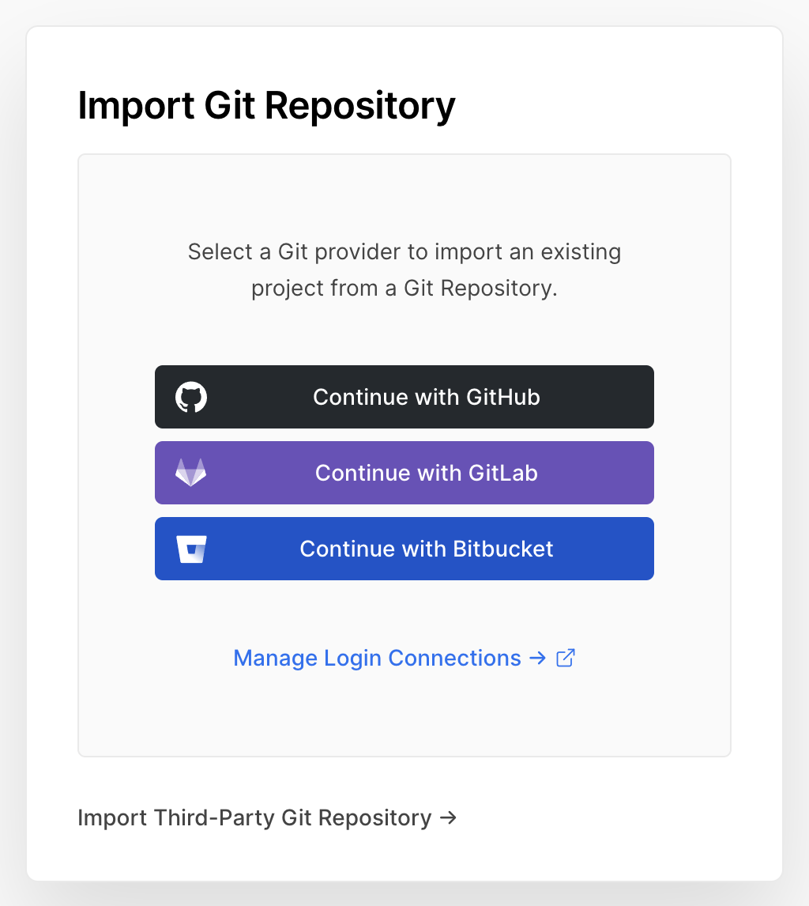
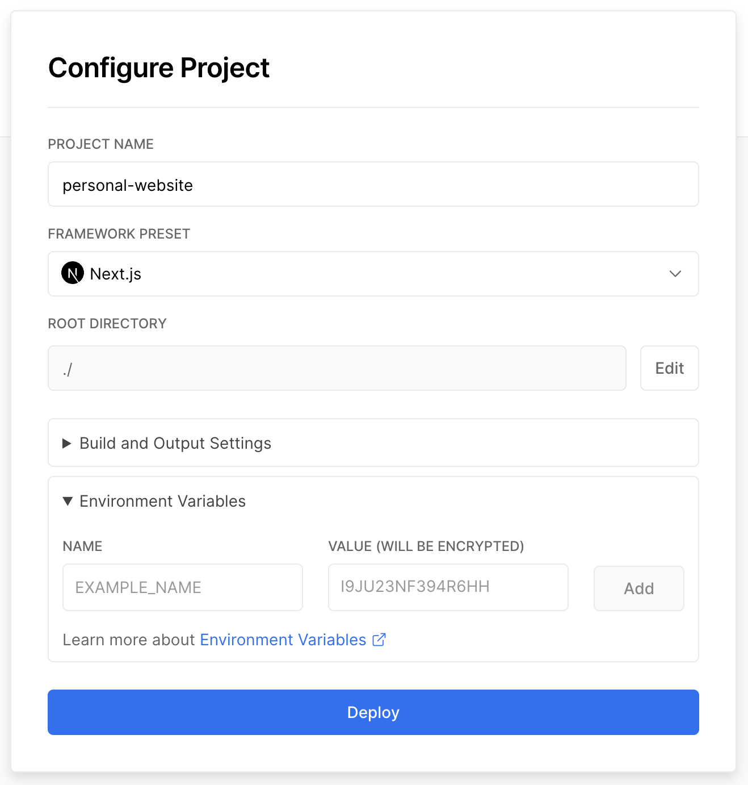

# Exercise 15: Deploy your Next.js app on Vercel

## Background

Next.js can be deployed anywhere, but the easiest way is to use the [Vercel](https://vercel.com) platform, which is created by the people who also created Next.js.

Vercel is optimized for Next.js. Out of the box, it applies the following optimizations to your app:
- Every page can either use Static Generation or Server-Side Rendering.
- Pages that use Static Generation and assets (JS, CSS, images, fonts, etc) will automatically be served from [Vercel's Edge Network](https://vercel.com/docs/edge-network/overview), which is blazingly fast.
- Pages that use Server-Side Rendering and API routes will automatically become isolated Serverless Functions. This allows page rendering and API requests to scale infinitely.

To deploy your app on Vercel, first you need to push it to a Git provider, like GitHub. Then, follow these steps:
<ul>
  <li>
    Sign up to Vercel (it's free, no credit card needed)
  </li>
  <li>
  

  

    Then you'll see the "Import Project" page. Pick the Git provider you host your app's source at.
  

  
  

  </li>
  <li>
  

  
After you've authenticated with your Git provider, you will see a list of your repos. Find the app you want to deploy and click on the "Import" button.

  
  

  </li>
  <li>
  

  

    Vercel will automatically figure out that it's a Next.js project, and it will apply the defaults for you. If you use any Environment Variables, make sure you add them in the "Environments Variables" section.
  

  
  

  </li>

  <li>
    When you're ready, hit the "Deploy" button and you app will be built and deployed in a few minutes.
  </li>
</ul>

Congratulations! You app is live now! 🎉

## 🚀 Exercise

Deploy this exercise to Vercel.